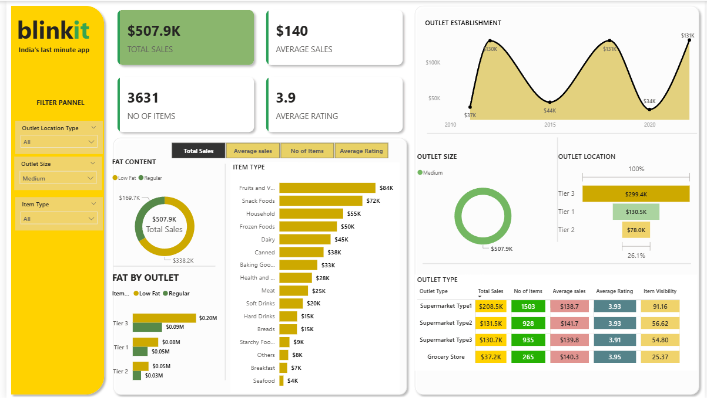

# Blinkit Sales Analysis Dashboard

An interactive Power BI dashboard analyzing retail sales performance across
outlet types, locations, and product categories — built on grocery/FMCG
sales data styled around Blinkit.

## What This Dashboard Shows

**Key metrics**
- Total Sales, Average Sales, Number of Items, and Average Rating as
  headline KPI cards
- Fully interactive filter panel: Outlet Location Type, Outlet Size,
  Item Type

**Sales by item type**
- Breakdown across 16 categories (Fruits & Vegetables, Snack Foods,
  Household, Frozen Foods, Dairy, and more), sorted highest to lowest

**Fat content analysis**
- Split between Low Fat and Regular items, both overall and by outlet tier

**Outlet analysis**
- Sales by outlet size (Small / Medium / High)
- Sales by outlet location tier (Tier 1 / Tier 2 / Tier 3)
- Outlet establishment trend over time (2010–2020+)
- A breakdown table by outlet type (Supermarket Type 1/2/3, Grocery Store)
  showing Total Sales, Number of Items, Average Sales, Average Rating, and
  Item Visibility side by side

**Interactivity**
- Four toggleable views: Total Sales, Average Sales, No. of Items, Average
  Rating — the whole page updates depending on which is selected
- All visuals respond to the filter panel on the left

## Tools Used

Power BI · DAX · Data modeling

## Dataset

Grocery/retail sales dataset covering outlet type, location tier, item
category, fat content, and sales figures across multiple outlets.
